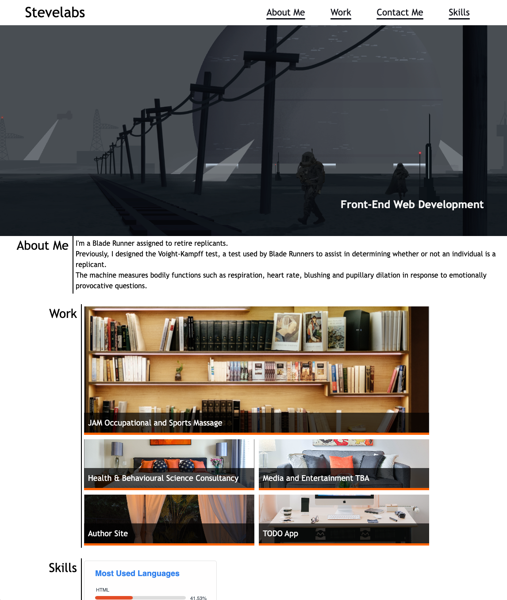

# portfolio-one

## A CCS portfolio combining CSS Grid and Flexbox

A beginner portfolio to showcase your work and show the core skills you learn prior to JavaScript: HTML and CSS (including flexbox, CSS Grid, media queries, and CSS variables).

## Includes:

- Placeholder for name, a hero image, links to sections about you, your work, and how to contact you
- When one of the links in the navigation is clicked then the UI scrolls to the corresponding section
- When viewing the section about your work then the section contains titled images of your applications
- When presented with the your first application then that application's image is larger in size than the others (for featured work)
- When the page is resized or viewed on various screens and devices then the layout is responsive and adapts to my viewport

## Screenshot

## Deployment:

- Application deployed at:

https://stevelab1.github.io/portfolio-one/

- Application GitHub repository:

https://github.com/stevelab1/portfolio-one
